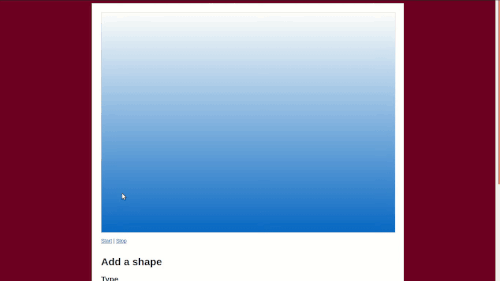

# Dynamic Animations #

This project is a showcase of my jQuery custom animation skills, and mostly a
proof to myself that I can. You can add multiple shapes (square, circle, or
triangle) that have different starting coordinates, ending coordinates, and
animation times. All animated objects move at the same time, so you can
orchestrate some pretty neat stuff with this app.

## Example Usage ##

  

## Installation ##

1. Clone this repository (`git clone https://github.com/johnisom/dynamic-animations`)
2. `cd` into the repository (`cd dynamic-animations`)
3. Open `index.html` in your favorite web browser
4. Have fun animating shapes
